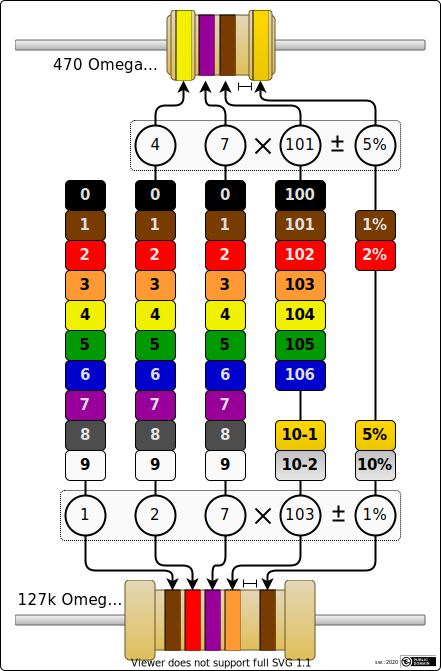

## Resistor Training

This simple HTML/JS/CSS based feature helps you memorizing the color
codes of resistors via repetitive training. Currently PTH 4-band and
5-band are implemented (no SMD yet).

The distribution file ...

  - [resistor-trainer.html](dist/resistor-training.singlefile.en.html)

... can be downloaded and used locally, or included into web services.
It consists of on-the-fly generated resistor images with changing band
colors, and one text input field. Pressing Enter shows if your answer
was correct, along with some additional information, such as the E-Series
where the resistance value can be found in, and some alternative
representations for the resistance (e.g. "10m", "4k7", "5M", etc). The
following cheat sheet is also inlined in the HTML file (accessible with
the small book icon).

#### System Requirements

- A contemporary browser or web engine is required.
- JavaScript has to be enabled.

#### Sources and Redistribution

You are free to use and redistribute this content according to the
[MIT license here](license). The separated source files are in located
in [src](src/).

- The MIT license headers in the code sources shall remain in the files.

- The images are released into the public domain and can be used or
  published without permission request. A link/reference to this repository
  would be kind but is not required.
